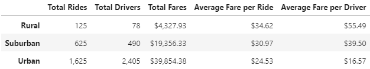
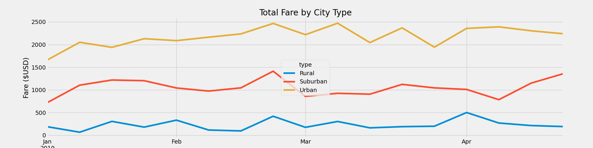

# PyBer_Analysis

## Overview of Analysis

The purpose of this project is to analyze and understand ride-sharing data by city type. Once complete, the decision-makers at PyBer can use the outputs to re-evaluate and make informed decisions on how to run the business more efficiently.

## Results

### Ride-sharing summary by City Type

By reviewing the summary, we can determine the following:
 - Urban cities generated the largest number of rides: 1,625
 - Urban cities contain the most drivers: 2,405
 - Rural cities generated the largest Average Fare per Ride: $34.62
 - Rural cities have the largest Average Fare per Driver: $55.49
 
### Total Fare by City Type

By reviewing this graph, we can determine the following:
 - The time of year does not have an overall impact on Fare across city type, as each city remains fairly consistent.
 - The third week of February generated a moderate uptick for each city type.  Deep diving to understand the driver here, may help to uncover future business opportunities.

## Summary

Recommendations to PyBer based on this analysis would be to:
1. Increase the number of drivers in Rural cities to ensure there are enough drivers to meet demand.  Since the Average Fare per Ride is higher than both Suburban and Urban cities (all other factors equal) would lead to the assumption Rural city drivers are going further distances, thus more time consumed for each ride.  Having more drivers would eliminate this conflict, thus allowing for more trips.
2. Reassess if so many drivers are required in Urban cities.  Considering there are more drivers than rides over this timeframe, reducing drivers may also reduce adminstrative costs associated to maintaining them on the company ledgers.
3. Collect additional data points, such as distance per ride, to enhance analysis and recommendations. 

 
